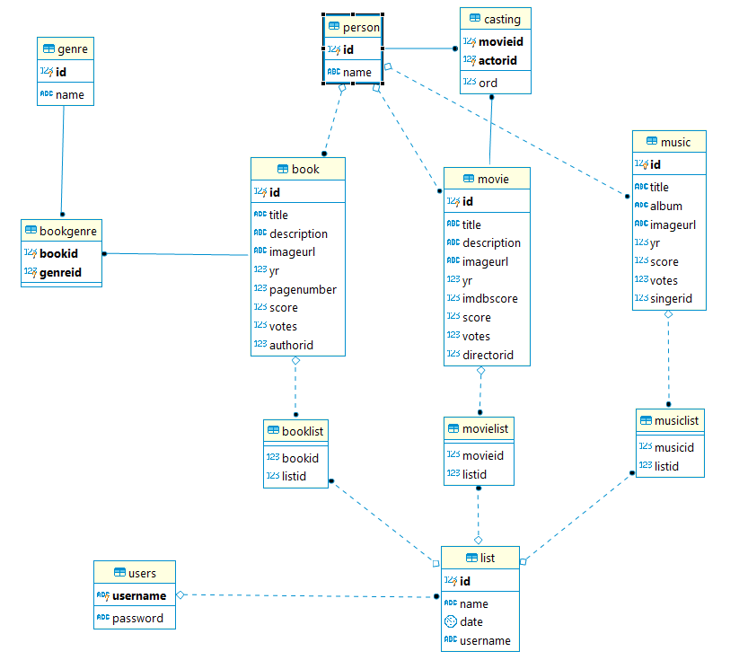

Developer Guide
===============

Database Design
---------------

Our database has three main tables that contain books (**Book**), movies (**Movie**) and music (**Music**). These tables store the specifics of items such as *item title*, *cover image* etc. All three tables are in a relation with the **Person** table. Person table contains all kind of people like actors, authors, directors etc. 
Additionally **Book** table has many to many relationship with **Genre** table. **Movie** table has a many to many relationship as well. It is connected to **Person** table through **Casting** table.

**List** table stores lists of users that contains all kind of items using **Booklist**, **Movielist**, **Musiclist** tables.
**User** table contains users and it has a one to many relationship with **List** table (A list belongs to one user).

Code
----

**explain the technical structure of your code**

**to include a code listing, use the following example**::

   .. code-block:: python

      class Foo:

         def __init__(self, x):
            self.x = x

.. toctree::

   member1
   member2
