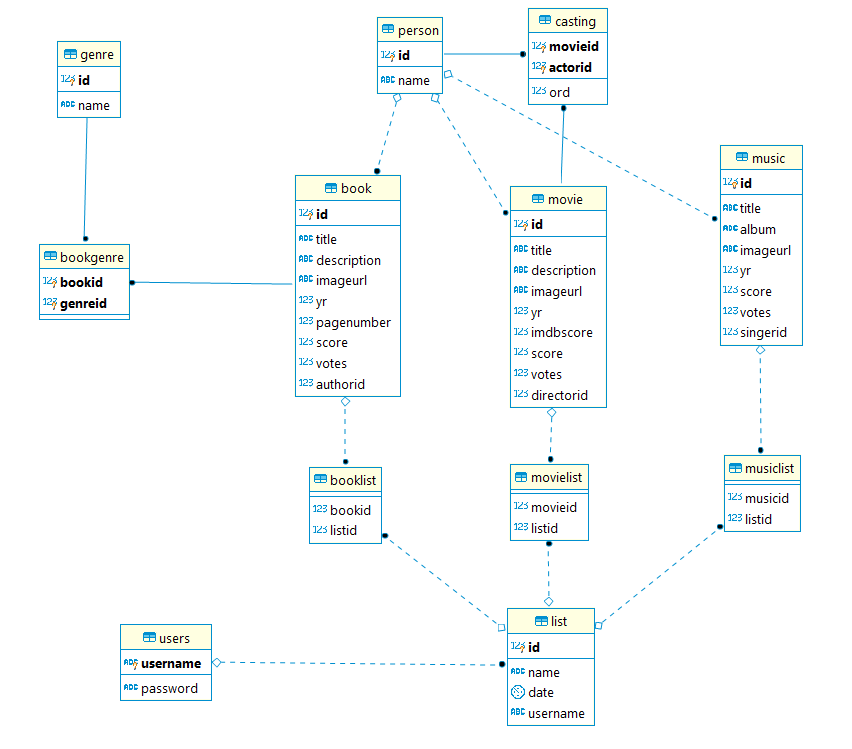
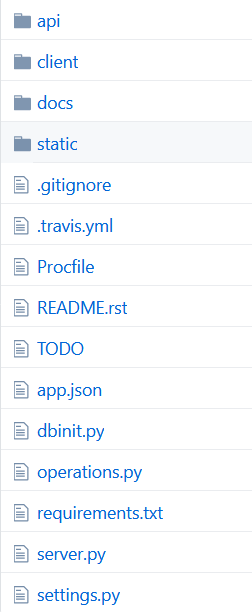

Developer Guide
===============

Database Design
---------------

Our database has three main tables that contain books (**Book**), movies (**Movie**) and music (**Music**). These tables store the specifics of items such as *item title*, *cover image* etc. All three tables are in a relation with the **Person** table. Person table contains all kind of people like actors, authors, directors etc. 
Additionally **Book** table has many to many relationship with **Genre** table. **Movie** table has a many to many relationship as well. It is connected to **Person** table through **Casting** table.

**List** table stores lists of users that contains all kind of items using **Booklist**, **Movielist**, **Musiclist** tables.
**User** table contains users and it has a one to many relationship with **List** table (A list belongs to one user).

Code
----

We used Flask, Postgresql and Reactjs in this project. Our files structure can be seen below.

**Api** folder is the backend service of our project. We connect Reactjs to flask using the api. The api is served at *<host address>/api*.

**Client** folder contains our react code. Source code of all the pages you can see are stored here.

**operations.py** file holds all database operations we use in this project. Such as *createUser* function below.

.. code-block:: python

  def createUser(username, password):
    with dbapi2.connect(url) as connection:
        with connection.cursor() as cursor:
            try:
                statement = """INSERT INTO USERS (USERNAME, PASSWORD) VALUES (%s, %s)"""
                cursor.execute(statement, (username, password))
                return True
            except:
                return False

**dbinit.py** wipes the database and creates tables then fills these tables with inital data.

To get more information go to the links below.

.. toctree::

   member1
   member2
